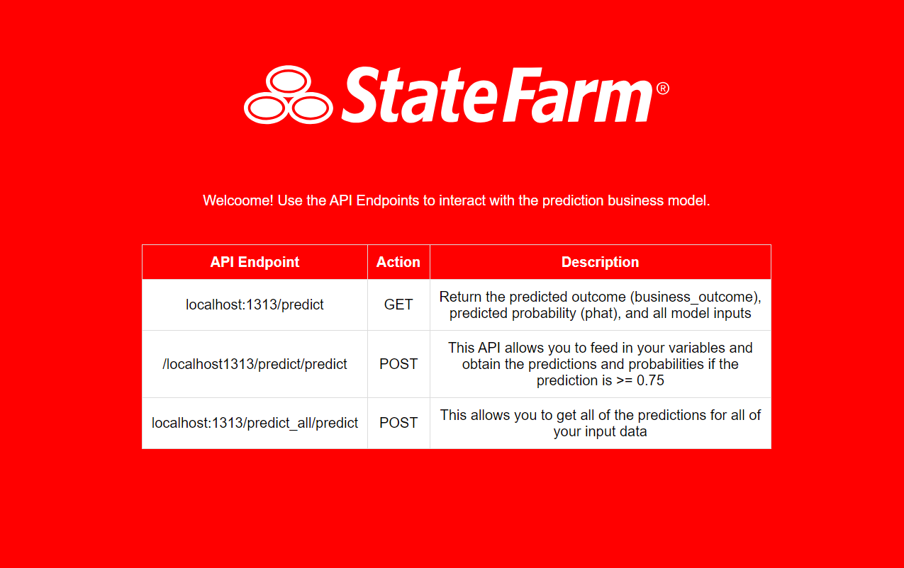

# state-farm-coding-exercise
***This project is a coding classification interview exercise for a Machine Learning position at State Farm.***

### Quick API Examples

| API Endpoint   | Action | Description        |
| -------------  | ------- |-------------      |
| /localhost1313 | `GET`   |This is the main api page, were you can get information   about the api calls |
|/localhost1313/predict | `POST` | This API allows you to feed in your variables and obtain the predictions and probabilities if the prediction is >= 0.75
|/localhost1313/predict_all | `POST` | This allows you to get all of the predictions for all of your input data |


### Installation
Download the project from the github repo and unzip the file. Open up a terminal and navigate to the project folder. You can then install all the requirements by typing in the following command:

```
pip install -r requirements.txt
```

Note also make sure that you have python version python 3.7.1 or greater. Here is how you can chech your current version:
```
python --version
```

If your not you can use this command to upgrade in your Windows machine:

```
py -m pip install --upgrade pip
```

or Linux/macOS:

```
brew upgrade python
```



